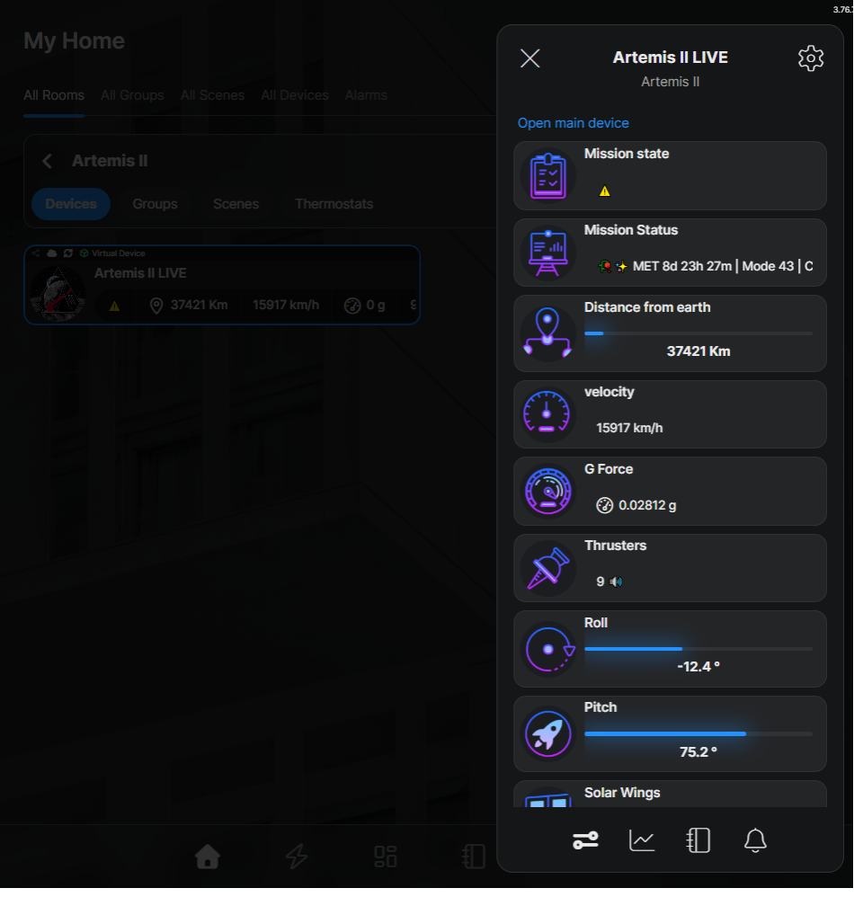

# ⚡SPARK_LABS · Artemis II Mission Control

> Turn any Shelly Gen3 / Gen4 device into a live Artemis II mission-control dashboard.

🥀 *One red rose per crew member. One white rose for those we lost.*
✨ *One stargazer lily for everyone watching from Earth.*
*Tradition upheld at Houston since STS-26, 1988.*

---

## What it does

A single Shelly script polls three public NASA-relay endpoints and pipes live Artemis II telemetry into virtual components on your device — viewable from the Shelly app like any other sensor, with full history logging built in.

No extra hardware. No cloud middleware. No home server. Just a Shelly, Wi-Fi, and a script.

## Live telemetry

**9 number components**

- 🌍 Distance from Earth (km)
- ☄️ Velocity (km/h)
- 🎢 G-Force
- 🚀 Pitch (°)
- 🔄 Roll (°)
- 🔥 Active RCS Thrusters (live count, 0–14)
- 📋 Mission State (enum: Nominal / Stale / LOS / Error / Boot)

**2 text components**

- 📊 **Mission Status** — combined readout: `🥀✨ MET 7d 21h 12m | Mode 85 | Canberra DSS43 | RTLT 1.58s`
- 🪟 **Solar Wings** — live angle of all 4 ESM solar arrays

## Hardware

Any Shelly Gen3 / Gen4 device with script support and virtual components. Wi-Fi internet access required. No physical wiring — the device doesn't control anything.

## Install

1. Open device web UI → **Scripts** → upload `Artemis_II_Installer.js`
2. Run it. Watch the HOUSTON console (T-minus countdown included)
3. Once HOUSTON signs off, follow the post-install checklist printed in the console:
   - Open Shelly Smart Control
   - Each number VC → edit → enable **event logs** → Statistics: **measurements**
   - Group → **Extract as virtual device** (Shelly Premium)
   - Upload mission patch image to the group
   - Verify `webIcon` on every component
4. Upload `Artemis_II_Live.js` and start it — telemetry begins

## Data sources

Public community relay of NASA AROW + JPL Horizons + DSN Now data:

- `https://artemis.cdnspace.ca/api/orbit` — distance, velocity, altitude, G-force
- `https://artemis.cdnspace.ca/api/arow` — attitude, mode, thrusters, solar arrays
- `https://artemis.cdnspace.ca/api/dsn` — active Deep Space Network dish + signal lag

Polled every 60 s. Not affiliated with NASA. Credit to the relay operators.

## Pro tip

Pair with Shelly Premium and Scenes to trigger smart-home events on live mission data. RGBW strips that change colour for orbital manoeuvres, engine burns, or a Mission State drop to LOS. Real spacecraft, real notifications.

## Built with

Shelly Gen3 / Gen4 mJS scripting. Validated against the SPARK_LABS Primer 1 §1.3 gotcha checklist.

## Credits

- NASA AROW & JPL Horizons — public ephemeris and telemetry
- artemis.cdnspace.ca — community relay
- The Shelton family of Texas — for the roses on the console since 1988
- Every nerd watching the sky from down here

---

**SPARK_LABS** — **S**helly **P**owered **A**utomation & **R**eliable **K**ontrol. Turning everyday Shelly devices into truly smart virtual appliances.

Godspeed, Artemis II. 🚀
